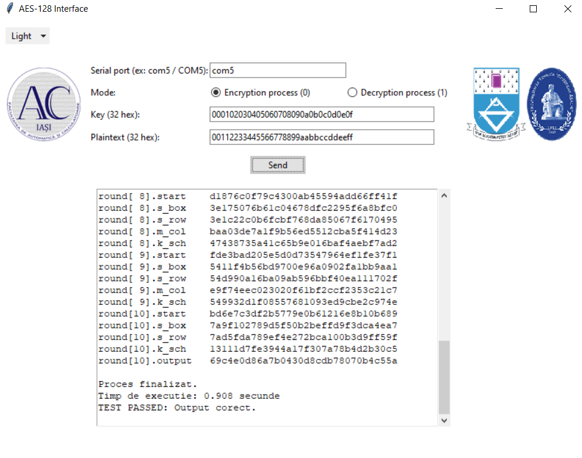

📌  Descriere Proiect de Licență -  Encryption/Decryption System(AES) implemented on FPGA

Proiectul meu de licență constă în dezvoltarea unui sistem de criptare și decriptare AES (Advanced Encryption Standard) implementat pe o placă FPGA (Field-Programmable Gate Array), utilizând limbajul hardware 
Verilog HDL pentru partea de design hardware și Python pentru interfața software cu rolul de a realiza un control cât mai intuitiv pentru utilizator. 

🔹 Scopul principal a fost crearea unei soluții integrate care combină hardware-ul FPGA (placa Boolean Board cu Spartan-7) cu o interfață grafică prietenoasă, permițând utilizatorilor să trimită date, să le 
cripteze sau decripteze conform standardului AES-128 și să vizualizeze în timp real stadiile intermediare ale procesului. Implementarea în Verilog include module separate pentru fiecare etapă a algoritmului AES 
(cum ar fi SubBytes, ShiftRows, MixColumns, AddRoundKey și KeyExpansion), optimizate pentru execuție eficientă pe FPGA, cu suport pentru comunicare serială prin protocolul UART la 9600 baud. 

🔹 Partea software, scrisă în Python cu biblioteci precum Tkinter pentru interfață și PySerial pentru comunicare, permite configurarea datelor de intrare (cheie și plaintext/ciphertext), afișarea rezultatelor 
rundelor și măsurarea timpului de execuție. Proiectul a fost validat prin simulări în Vivado și teste practice pe placă, demonstrând o funcționalitate completă și o securitate îmbunătățită prin implementarea 
hardware, fiind un exemplu educațional și aplicabil în domenii precum securitatea datelor și sistemele embedded.

Soluția propusă:

AES-128 Interface 
 • Implementarea AES-128 pe FPGA
 • Comunicația UART bidirecțională
 • Interfață Python + Tkinter
 • Vizualizare completă a întregului proces
 • Timp de execuție
 • Mod Dark/Light la alegerea utilizatorului
